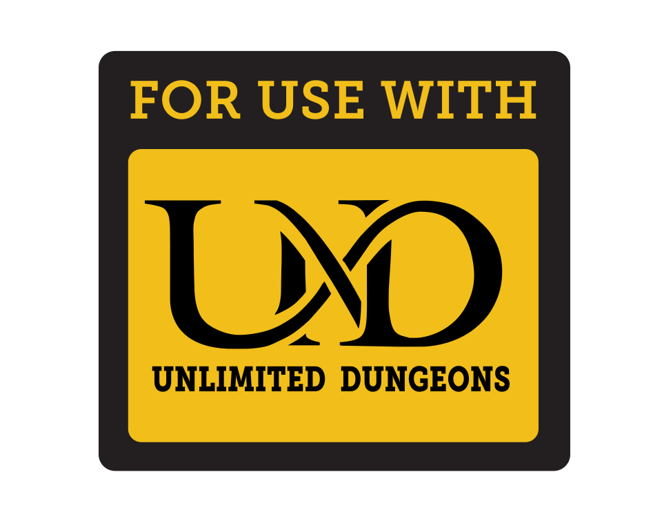

# Unlimited Dungeons

&nbsp;&nbsp;&nbsp;&nbsp;&nbsp;&nbsp;&nbsp;&nbsp;&nbsp;
_Here you shall find miscellaneous items related to <a href="https://drive.google.com/file/d/1JIOhe5uSeZM4rkqeOJaQC7CQ1lOyRhRB/view">Unlimited Dungeons - A Dungeon World Rules Hack</a>_

## Table of Contents

* [A logo specifically designed for Unlimited Dungeons](#user-content-logo)
* [A "For use with" / "Compatible with" logo](#user-content-compatible-with-logo) -- Similar to the one for Dungeon World
* [Alternate rule booklet cover](#user-content-alternate-rule-booklet-cover)

## Logo

## Compatible-with Logo

## Alternate rule booklet cover

## License

<a href="LICENSE">CC-BY-SA-4.0</a>
